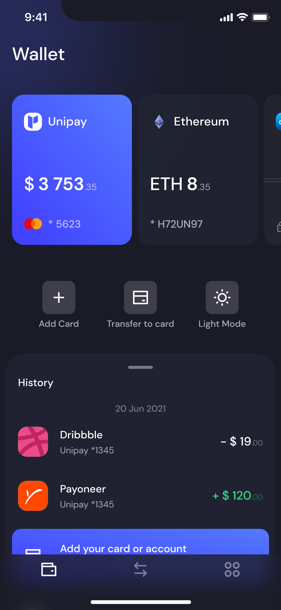

# Crossbuild UI ✨

Welcome to the official **Crossbuild UI** GitHub repository — the central hub for open-source themes and app templates built using the [Crossbuild UI](https://www.crossbuildui.com). This repo powers the core visual identity and reusable app structure for teams building Expo apps with both **speed** and **style**.

> 🚀 Use our templates to kickstart your next mobile app project with out-of-the-box support for theming, responsiveness, and accessibility.

### 🎨 Figma-to-Code Reference

The following preview images are directly based on original Figma designs. These serve as visual references for developers to recreate pixel-perfect UIs using Crossbuild UI components in Expo apps.

You can access the original Figma files here:
[Figma Design File – Stock App](https://www.figma.com/design/zwzraXXhGMvlsHTRiU4qSt/Colorful-Stock-App---iOS-UI-Kit--Community-?m=auto&t=sgQj250NDCxdlCaO-6)
[Figma Design File – Wallet App](https://www.figma.com/design/HvktxTgLVFeLC34cosA12u/Unipay--Wallet-App-iOS-UI-Design-System-v1.1--Community-)

  

---

## 🌱 What's Inside

This monorepo contains:

### 📦 Templates (`/templates`)

Pre-configured Expo app boilerplates using Crossbuild UI components:

- **`default/`** – A minimal, clean slate to get started with Expo + Crossbuild UI.
- **`stock-app/`** – A minimal, stock app inspired from figma to get started with Expo + Crossbuild UI.
- More templates and examples, including visual previews, coming soon!

Each template includes:

- Crossbuild UI theming (`@crossbuildui/core`)
- Dark/light mode support
- Organized file structure for scalability
- Instant Expo compatibility

> 📚 See the [Installation Guide](https://www.crossbuildui.com/docs/getting-started/installation) to install and configure templates or create your own.

### 🎨 Themes (`/themes`)

Modular theme files you can copy or extend in your project:

- `default-theme.ts`
- `modern-theme.ts`
- More coming soon...

These themes define color palettes, typography, spacing, and tokenized styles. You can easily plug them into any Expo app using Crossbuild UI's theming system.

> 📚 See the [Theming Guide](https://www.crossbuildui.com/docs/getting-started/theming) for full customization instructions.

---

## 🛠️ Getting Started

Choose a template and launch your app in minutes.

### 1. Clone the template

```bash
cbui-cli init my-expo-app@latest
# or specify a template
cbui-cli init my-expo-app@latest --template default
cd my-expo-app
````

### 2. Install dependencies

```bash
npm install
cbui-cli install #need to run if using any template other than default
```

### 3. Run the app with Expo

```bash
npx expo start
```

> Substitute `default` with `cbui-free` or `cbui-pro` to explore other options.

---

## 📚 Documentation & Resources

* [Getting Started Guide](https://www.crossbuildui.com/docs/getting-started/introduction)
* [Theming System](https://www.crossbuildui.com/docs/getting-started/theming)
* [Component Library](https://www.crossbuildui.com/docs/components/button)
* [API Reference](https://www.crossbuildui.com/docs/api/core)

---

## 💬 Join the Community

* 🤝 [GitHub Discussions](https://github.com/crossbuildui/crossbuildui/discussions)
* 💬 [Discord](https://discord.gg/UNFyAjsp)

---

## 🤝 Contributing

We welcome contributions to templates, themes, and documentation! Start here:

* 📄 [CONTRIBUTING.md](./CONTRIBUTING.md)
* ✅ [Template Submission Checklist](./.github/TEMPLATE_SUBMISSION_CHECKLIST.md)
* 🐛 [Bug Report Form](https://github.com/crossbuildui/crossbuildui/issues/new?template=bug-report.yml)
* 🎨 [Theme Submission Form](https://github.com/crossbuildui/crossbuildui/issues/new?template=theme-submission.yml)

> Note: Contributions to core components are **invite-only**. To apply, email us at [support@crossbuildui.com](mailto:support@crossbuildui.com) with your GitHub profile and experience.

---

## 🛡 Code of Conduct

All contributors are expected to follow our [Code of Conduct](./CODE_OF_CONDUCT.md).

---

## 📝 License

This project is licensed under the [Crossbuild UI License](./LICENSE).
